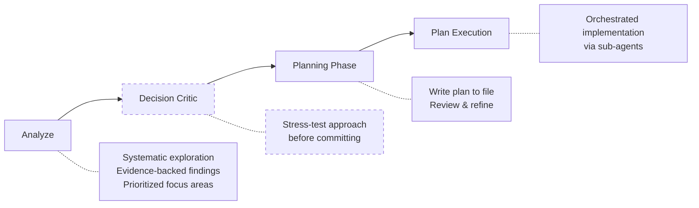
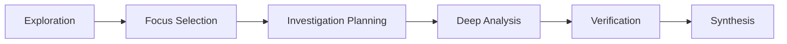
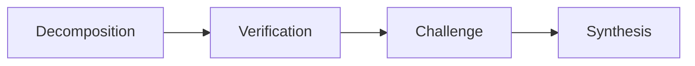
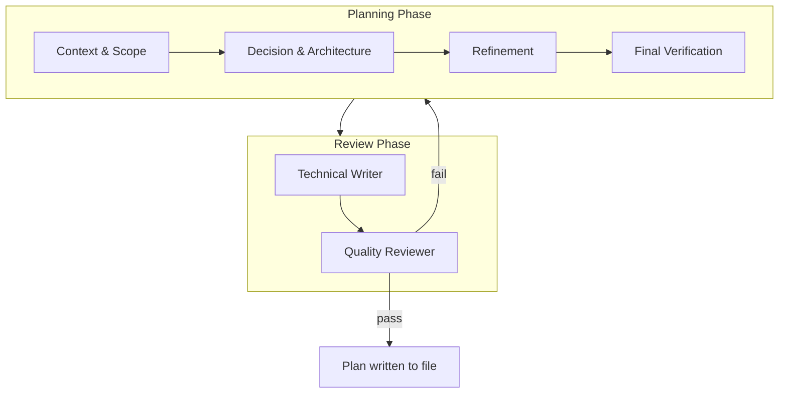
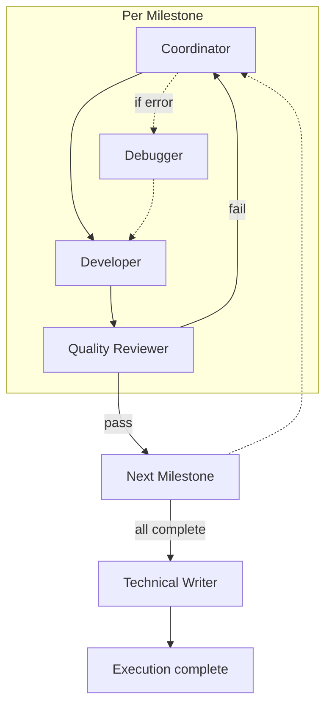

# Claude Code Workflow Extensions

A collection of skills, agents, and commands for Claude Code, implementing an
opinionated workflow designed for long-term software maintenance with LLM
coding agents.

## Philosophy

LLM-assisted coding fails long-term because technical debt accumulates
unaddressed. I treat that as an engineering problem.

LLMs are tools, not collaborators. They cannot infer unspoken context -- the
culture, assumptions, and shared experiences that humans understand naturally.
When an engineer says "add retry logic", another engineer infers exponential
backoff, jitter, idempotency. An LLM infers nothing you do not explicitly state.

LLMs also have limited attention. Larger context windows do not solve this --
giving an LLM more text is like giving a human a larger stack of papers.
Attention drifts to the beginning and end; details in the middle are missed.
The solution is not more context, but precisely the right context.

This workflow addresses these failures through four principles:

### Context Hygiene

Each task receives precisely the information it needs -- no more. Sub-agents
start with fresh, focused context. CLAUDE.md files in each directory serve as
indexes; README.md captures decisions invisible in code.

Hygiene extends to code artifacts. Comments are scrubbed for temporal
contamination ("Added X" becomes "X handles Y"). Documentation uses tabular
indexes, not prose. Functions include "use when..." triggers and usage
examples. Decision rationale lives in README.md files, not lost chat history.
These rules prevent cruft accumulation.

### Planning Before Execution

LLMs make first-shot mistakes. The workflow separates planning from execution,
forcing ambiguities to surface when they are cheap to fix. Analysis is separate
from implementation. Each phase has clear inputs and outputs.

Plans capture why decisions were made, what alternatives were rejected, and
what risks were accepted. This survives context clears and new sessions --
the reasoning persists even when the conversation does not.

### Review Cycles

Plans pass through quality gates with multiple iterations until all checks
pass. Technical writer and quality reviewer run before execution begins,
catching issues when they are cheap to fix. Execution generates retrospectives
that feed back into planning.

### Cost-Effective Delegation

The orchestrator runs on a capable model, but delegates execution to smaller
agents -- Haiku-class for straightforward tasks, Sonnet-class for moderate
complexity. Just-in-time prompt injection provides precise guidance at each
step, allowing smaller models to perform reliably.

Model selection is dynamic. When quality review fails, issues appear subtle,
or problems recur, the orchestrator progressively escalates to higher-quality
models. The heavy lifting happens in well-scoped tasks with clear instructions;
expensive frontier models are reserved for genuine ambiguity, not routine work.

Plans are written to files. Execution can be interrupted and resumed.
Reconciliation detects already-completed milestones.

---

This workflow is opinionated. I am a backend engineer by trade -- the workflow
should apply equally to frontend, but feedback welcome. Same for whether these
patterns translate to less experienced engineers.

## Quick Start

Install by cloning into your Claude Code configuration directory:

```bash
# Per-project installation
git clone https://github.com/solatis/claude-config .claude

# Global installation (new)
git clone https://github.com/solatis/claude-config ~/.claude

# Global installation (existing ~/.claude with files)
cd ~/.claude
git remote add workflow https://github.com/solatis/claude-config
git fetch workflow
git merge workflow/main --allow-unrelated-histories
```

For non-trivial changes, the workflow is: explore -> plan -> execute.

1. Investigate the problem, ask clarifying questions
2. "Use your planner skill to write a plan to plans/my-feature.md"
3. `/clear` -- reset context
4. `/plan-execution plans/my-feature.md` -- execute via sub-agents

For details, see [The Workflow](#the-workflow).

## The Workflow

The primary workflow for non-trivial changes:



Note: Decision Critic (dashed) is optional.

### Step 1: Analyze

Start with systematic exploration using the analyze skill:

```
Use your analyze skill to understand this codebase before we plan changes.
Focus on: [architecture / performance / security / quality]
```

The analyze skill runs a six-phase workflow: exploration (via Explore sub-agent),
focus selection, investigation planning, deep analysis, verification, and
synthesis. Each finding requires evidence -- file:line references and quoted
code. See [Analyze](#analyze) for the full phase breakdown.

### Step 2: Decision Critic (Optional)

If you're uncertain about your approach, or want to make sure you're not
overlooking something, invoke the decision critic skill:

```
Use your decision critic skill to stress-test my reasoning about the retry
logic approach before we commit to a plan.
```

This forces adversarial analysis of your assumptions and approach. Skip this
step for straightforward changes where the path forward is clear. See
[Decision Critic](#decision-critic) for details.

### Step 3: Invoke the Planner Skill

Once you understand what needs to be done:

```
"Now use your planner skill to write an implementation plan to plans/api-retry.md"
```

The planner runs a multi-step process: context gathering, decision/architecture,
refinement, then review by technical writer and quality reviewer. The review
loop catches LLM mistakes before execution begins. See [Planner](#planner) for
the full phase breakdown.

### Step 4: Clear Context

After planning completes:

```
/clear
```

This clears the conversation context, preventing the exploration/planning phase
from polluting the execution phase.

### Step 5: Execute the Plan

```
/plan-execution plans/api-retry.md
```

Plan execution delegates to specialized agents (developer, debugger,
quality-reviewer, technical-writer). The coordinator never writes code directly
-- it orchestrates. See [Plan Execution](#plan-execution) for the delegation
flow.

---

## Workflow Skills

These skills form the core workflow, used in sequence.

### Analyze

The analyze skill provides systematic codebase investigation with structured
phases and evidence requirements. Use it as the first step before planning any
non-trivial changes.



| Phase                  | Actions                                                                        |
| ---------------------- | ------------------------------------------------------------------------------ |
| Exploration            | Delegate to Explore agent; process structure, tech stack, patterns             |
| Focus Selection        | Classify areas (architecture, performance, security, quality); assign P1/P2/P3 |
| Investigation Planning | Commit to specific files and questions; create accountability contract         |
| Deep Analysis          | Progressive investigation; document with file:line + quoted code               |
| Verification           | Audit completeness; ensure all commitments addressed                           |
| Synthesis              | Consolidate by severity; provide prioritized recommendations                   |

#### When to Use

- Unfamiliar codebase requiring systematic understanding
- Security review or vulnerability assessment
- Performance analysis before optimization
- Architecture evaluation before major refactoring
- Any situation requiring evidence-backed findings (not impressions)

#### When to Skip

- You already understand the codebase well
- Simple bug fix with obvious scope
- User has provided comprehensive context

#### Example Usage

```
Use your analyze skill to understand this codebase.
Focus on security and architecture before we plan the authentication refactor.
```

The skill outputs findings organized by severity (CRITICAL/HIGH/MEDIUM/LOW),
each with file:line references and quoted code. This feeds directly into
planning -- you have evidence-backed understanding before proposing changes.

### Decision Critic

LLMs tend toward sycophancy -- agreeing with the user rather than providing
genuine pushback. For important architectural decisions, you want stress-testing,
not validation.

The decision-critic skill forces structured adversarial analysis:



| Phase         | Actions                                                                    |
| ------------- | -------------------------------------------------------------------------- |
| Decomposition | Extract claims, assumptions, constraints; assign IDs; classify each        |
| Verification  | Generate questions for verifiable items; answer independently; mark status |
| Challenge     | Steel-man argument against; explore alternative framings                   |
| Synthesis     | Verdict (STAND/REVISE/ESCALATE); summary and recommendation                |

#### When to Use

Use for important decisions where you want genuine criticism, not agreement:

- Architectural choices with long-term consequences
- Technology selection (language, framework, database)
- Tradeoffs between competing concerns (performance vs. maintainability)
- Decisions you're uncertain about and want stress-tested

#### Example Usage

```
I'm considering using Redis for our session storage instead of PostgreSQL.
My reasoning:

- Redis is faster for key-value lookups
- Sessions are ephemeral, don't need ACID guarantees
- We already have Redis for caching

Use your decision critic skill to stress-test this decision.
```

The skill will:

1. **Decompose** the decision into claims (C1: Redis is faster), assumptions
   (A1: sessions don't need durability), constraints (K1: Redis already deployed)
2. **Verify** each claim -- is Redis actually faster for your access pattern?
   What's the actual latency difference?
3. **Challenge** -- what if sessions DO need durability (shopping carts)?
   What's the operational cost of Redis failures?
4. **Synthesize** -- verdict with specific failed/uncertain items

#### The Anti-Sycophancy Design

The skill is grounded in three research-backed techniques:

- **Chain-of-Verification** (Dhuliawala et al., 2023) -- factored verification
  prevents confirmation bias by answering questions independently
- **Self-Consistency** (Wang et al., 2023) -- multiple reasoning paths reveal
  disagreement
- **Multi-Expert Prompting** (Wang et al., 2024) -- diverse perspectives catch
  blind spots

The 7-step structure forces the LLM through adversarial phases rather than
allowing it to immediately agree with your reasoning.

### Planner

The planner skill runs a multi-step planning process with built-in review:



**Planning Phase:**

| Step                    | Actions                                                                    |
| ----------------------- | -------------------------------------------------------------------------- |
| Context & Scope         | Confirm path, define scope, identify approaches, list constraints          |
| Decision & Architecture | Evaluate approaches, select with reasoning, diagram, break into milestones |
| Refinement              | Document risks, add uncertainty flags, specify paths and criteria          |
| Final Verification      | Verify completeness, check specs, write to file                            |

**Review Phase:**

| Step             | Actions                                                                            |
| ---------------- | ---------------------------------------------------------------------------------- |
| Technical Writer | Scrub temporal comments, add WHY comments, enrich rationale                        |
| Quality Reviewer | Check reliability, check conformance, return PASS/PASS_WITH_CONCERNS/NEEDS_CHANGES |

The review feedback loop catches LLM mistakes before execution begins. Plans
frequently have gaps -- missing error handling, incomplete acceptance criteria,
ambiguous specifications. The workflow iterates until QR passes, ensuring
problems are caught when they are cheap to fix rather than during implementation.

### Plan Execution

Plan execution delegates to specialized agents:



The coordinator:

- Never writes code directly (delegates to developers)
- Parallelizes independent work across up to 4 developers per milestone
- Runs quality review after each milestone
- Sequences dependent milestones
- Invokes technical writer only after all milestones complete

The quality review feedback loop is intentional. LLMs almost always have
oversights -- missed edge cases, incomplete implementations, sometimes entire
components skipped. The workflow treats this as expected, not exceptional. When
QR fails, the coordinator receives specific findings and delegates fixes. This
cycle repeats until QR passes, then the next milestone begins.

The technical writer runs once at the end, updating the CLAUDE.md/README.md
hierarchy for all changes made during execution.

---

## Standalone Skills

These skills can be used independently, outside the main workflow.

### Prompt Engineer

A meta-skill for optimizing prompts themselves. Since this entire workflow
consists of prompts consumed by LLMs, each can be individually optimized.

#### When to Use

- Optimizing a sub-agent definition (`agents/developer.md`)
- Improving a skill's Python script prompts (`skills/planner/scripts/planner.py`)
- Reviewing an entire multi-prompt workflow for consistency
- Any prompt that isn't performing as expected

#### How It Works

1. Reads prompt engineering pattern references
2. Analyzes the prompt(s) for issues
3. Proposes changes with explicit pattern attribution
4. Waits for approval before applying changes
5. Presents optimized result with self-verification

The skill uses recitation and careful output ordering to ground itself in the
referenced patterns -- it was optimized using itself.

#### Example Usage

Optimize a sub-agent:

```
Use your prompt engineer skill to optimize the system prompt for
the following claude code sub-agent: agents/developer.md
```

Optimize a multi-prompt workflow:

```
Consider @skills/planner/scripts/planner.py. Identify all prompts,
understand how they interact, then use your prompt engineer skill
to optimize each.
```

#### Example Output

Each proposed change includes scope, problem, technique, before/after, and
rationale. A single invocation may propose many changes:

```
  +==============================================================================+
  |  CHANGE 1: Add STOP gate to Step 1 (Exploration)                             |
  +==============================================================================+
  |                                                                              |
  |  SCOPE                                                                       |
  |  -----                                                                       |
  |  Prompt:      analyze.py step 1                                              |
  |  Section:     Lines 41-49 (precondition check)                               |
  |  Downstream:  All subsequent steps depend on exploration results             |
  |                                                                              |
  +------------------------------------------------------------------------------+
  |                                                                              |
  |  PROBLEM                                                                     |
  |  -------                                                                     |
  |  Issue:    Hedging language allows model to skip precondition                |
  |                                                                              |
  |  Evidence: "PRECONDITION: You should have already delegated..."              |
  |            "If you have not, STOP and do that first"                         |
  |                                                                              |
  |  Runtime:  Model proceeds to "process exploration results" without having    |
  |            any results, produces empty/fabricated structure analysis         |
  |                                                                              |
  +------------------------------------------------------------------------------+
  |                                                                              |
  |  TECHNIQUE                                                                   |
  |  ---------                                                                   |
  |  Apply:    STOP Escalation Pattern (single-turn ref)                         |
  |                                                                              |
  |  Trigger:  "For behaviors you need to interrupt, not just discourage"        |
  |  Effect:   "Creates metacognitive checkpoint--the model must pause and       |
  |             re-evaluate before proceeding"                                   |
  |  Stacks:   Affirmative Directives                                            |
  |                                                                              |
  +------------------------------------------------------------------------------+
  |                                                                              |
  |  BEFORE                                                                      |
  |  ------                                                                      |
  |  +----------------------------------------------------------------------+    |
  |  | "PRECONDITION: You should have already delegated to the Explore      |    |
  |  |  sub-agent.",                                                        |    |
  |  | "If you have not, STOP and do that first:",                          |    |
  |  +----------------------------------------------------------------------+    |
  |                                                                              |
  |                                    |                                         |
  |                                    v                                         |
  |                                                                              |
  |  AFTER                                                                       |
  |  -----                                                                       |
  |  +----------------------------------------------------------------------+    |
  |  | "STOP. Before proceeding, verify you have Explore agent results.",   |    |
  |  | "",                                                                  |    |
  |  | "If your --thoughts do NOT contain Explore agent output, you MUST:", |    |
  |  | "  1. Use Task tool with subagent_type='Explore'                     |    |
  |  | "  2. Prompt: 'Explore this repository. Report directory structure,  |    |
  |  | "     tech stack, entry points, main components, observed patterns.' |    |
  |  | "  3. WAIT for results before invoking this step again               |    |
  |  | "",                                                                  |    |
  |  | "Only proceed below if you have concrete Explore output to process." |    |
  |  +----------------------------------------------------------------------+    |
  |                                                                              |
  +------------------------------------------------------------------------------+
  |                                                                              |
  |  WHY THIS IMPROVES QUALITY                                                   |
  |  -------------------------                                                   |
  |  Transforms soft precondition into hard gate. Model must explicitly verify   |
  |  it has Explore results before processing, preventing fabricated analysis.   |
  |                                                                              |
  +==============================================================================+

  ... many more


  ---
  Compatibility check:
  - STOP Escalation + Affirmative Directives: Compatible (STOP is for interrupting specific behaviors)
  - History Accumulation + Completeness Checkpoint Tags: Synergistic (both enforce state tracking)
  - Quote Extraction + Chain-of-Verification: Complementary (both prevent hallucination)
  - Progressive depth + Pre-Work Context Analysis: Sequential (planning enables deeper execution)

  Anti-patterns verified:
  - No hedging spiral (replaced "should have" with "STOP. Verify...")
  - No everything-is-critical (CRITICAL used only for state requirement)
  - Affirmative directives used (changed negatives to positives)
  - No implicit category trap (explicit checklists provided)

  ---
  Does this plan look reasonable? I'll apply these changes once you confirm.
```

#### Caveat

When you tell an LLM "find problems and opportunities for optimization", it will
always find "problems" -- that's what it was asked to do. Some may not be real
issues. Invoke the skill multiple times on challenging prompts, but recognize
when it's good enough and stop.

### Doc Sync

The CLAUDE.md/README.md hierarchy is central to context hygiene. CLAUDE.md files
are pure indexes -- tabular navigation with "What" and "When to read" columns
that help LLMs (and humans) find relevant files without loading everything.
README.md files capture invisible knowledge: architecture decisions, design
tradeoffs, invariants that are not apparent from reading code.

The `doc-sync` skill audits and synchronizes this hierarchy across a repository.

#### How It Works

1. **Discovery** -- Maps all directories, identifies missing or outdated
   CLAUDE.md files
2. **Audit** -- Checks for drift (files added/removed but not indexed),
   misplaced content (architecture docs in CLAUDE.md instead of README.md)
3. **Migration** -- Moves architectural content from CLAUDE.md to README.md
4. **Update** -- Creates/updates indexes with proper tabular format
5. **Verification** -- Confirms complete coverage and correct structure

#### When to Use

- **Bootstrapping** -- Adopting this workflow on an existing repository
- **After bulk changes** -- Major refactors, directory restructuring
- **Periodic audits** -- Checking for documentation drift
- **Onboarding** -- Before starting work on an unfamiliar codebase

If you use the planning workflow consistently, the technical writer agent
maintains documentation as part of execution. The `doc-sync` skill is primarily
for bootstrapping or recovery.

#### Example Usage

```
Use your doc-sync skill to synchronize documentation across this repository
```

For targeted updates:

```
Use your doc-sync skill to update documentation in src/validators/
```

---

## How Skills Use Python Scripts

Skills can include Python scripts for "just in time" prompt injection. Rather
than loading a massive prompt upfront, the script outputs step-specific
guidance based on workflow state.

Example from `planner.py`:

```python
def get_planning_step_guidance(step_number: int, total_steps: int) -> dict:
    """Returns guidance for planning phase steps."""

    if step_number == 1:
        return {
            "actions": [
                "PRECONDITION: Confirm plan file path before proceeding.",
                "CONTEXT (understand before proposing):",
                "  - What code/systems does this touch?",
                # ... step 1 specific guidance
            ],
            "next": f"Invoke step {next_step} with your context analysis."
        }

    if step_number == 2:
        return {
            "actions": [
                "BEFORE deciding, evaluate each approach:",
                # ... step 2 specific guidance
            ],
            "next": f"Invoke step {next_step} with your chosen approach."
        }
    # ... and so on
```

Invocation:

```bash
python3 scripts/planner.py --step-number 1 --total-steps 4 --thoughts "..."
```

This pattern keeps context focused, allows workflows that adapt based on
intermediate results, and enables cost-effective model selection -- smaller
models can handle well-scoped tasks with precise instructions.

---

## Acknowledgments

I stood on the shoulders of giants, and [Southbridge Research's exceptional analysis of Claude Code prompts](https://southbridge-research.notion.site/Prompt-Engineering-The-Art-of-Instructing-AI-2055fec70db181369002dcdea7d9e732) has been of tremendous help to kick-start my understanding of how to write effective prompts.
