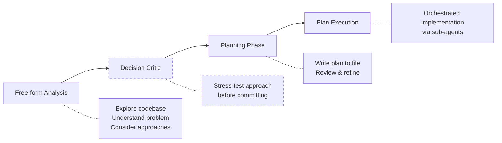
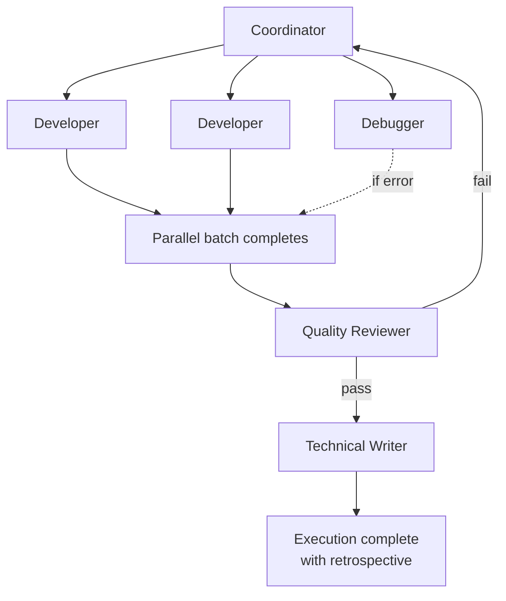
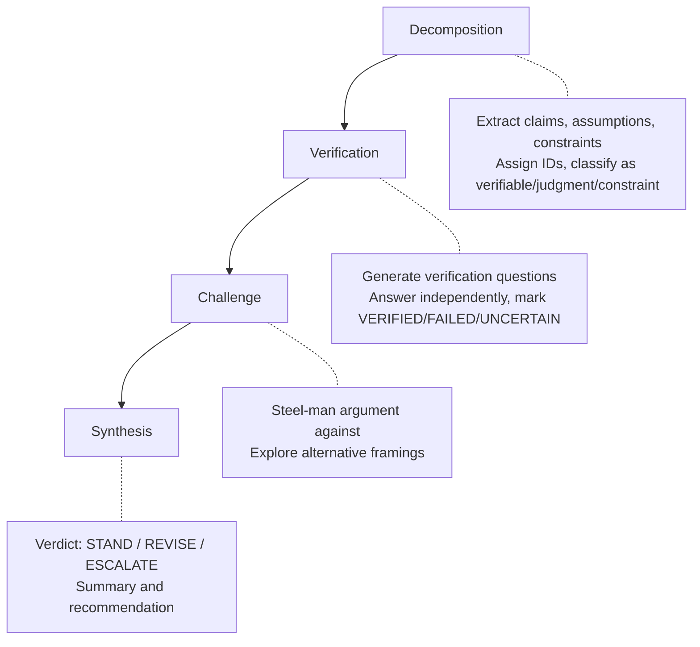

# Claude Code Workflow Extensions

A collection of skills, agents, and commands for Claude Code, implementing an
opinionated workflow designed for long-term software maintenance with LLM
coding agents.

## Philosophy

LLM-assisted coding fails long-term because technical debt accumulates
unaddressed. I treat that as an engineering problem.

LLMs are tools, not collaborators. They cannot infer unspoken context -- the
culture, assumptions, and shared experiences that humans understand naturally.
When an engineer says "add retry logic", another engineer infers exponential
backoff, jitter, idempotency. An LLM infers nothing you do not explicitly state.

LLMs also have limited attention. Larger context windows do not solve this --
giving an LLM more text is like giving a human a larger stack of papers.
Attention drifts to the beginning and end; details in the middle are missed.
The solution is not more context, but precisely the right context.

The safeguards:

- **Context hygiene** -- Each task receives precisely the information it needs.
  Sub-agents start with fresh, focused context. CLAUDE.md files in each
  directory serve as indexes; README.md captures decisions invisible in code.
  The `doc-sync` skill bootstraps and maintains this hierarchy.
- **Planning that resolves ambiguities** -- LLMs make first-shot mistakes. The
  workflow separates planning from execution, forcing ambiguities to surface
  when they are cheap to fix.
- **Multi-turn review cycles** -- Plans pass through quality gates with multiple
  iterations until all checks pass. Execution generates retrospectives that feed
  back into planning.
- **Documentation for LLM consumption** -- Functions include "use when..."
  triggers and usage examples. Decision rationale lives in README.md files, not
  lost chat history.

This workflow is opinionated. I am a backend engineer by trade -- the workflow
should apply equally to frontend, but feedback welcome. Same for whether these
patterns translate to less experienced engineers.

## Components

**Skills** -- Multi-turn workflows via Python scripts with just-in-time prompts:

- `planner` -- Structured implementation planning with quality review gates
- `prompt-engineer` -- Prompt optimization using documented patterns
- `decision-critic` -- Adversarial analysis to counter LLM sycophancy
- `doc-sync` -- Synchronizes CLAUDE.md indexes and README.md architecture docs;
  useful for bootstrapping a repository into this workflow

**Agents** -- Specialized sub-agents with domain expertise:

- `developer` -- Implements specifications with tests
- `debugger` -- Systematic bug analysis through evidence gathering
- `quality-reviewer` -- Production risk and project conformance checks
- `technical-writer` -- Documentation optimized for LLM consumption

**Commands** -- Entry points for workflows:

- `plan-execution` -- Executes approved plans via agent delegation

## Repository Structure

```
agents/                  Sub-agent definitions (*.md)
commands/                Workflow entry points (*.md)
skills/                  Multi-turn workflows
  <skill>/
    SKILL.md             Entry point
    scripts/             Just-in-time prompt injection
    resources/           Shared formats and conventions
```

---

## The Planning Workflow

The primary workflow for non-trivial changes:



Note: Decision Critic (dashed) is optional.

### Step 1: Free-form Analysis

Start with open exploration. Claude Code investigates the problem space:

```
I need to add retry logic to our API client.

Before proposing a solution:
- Explore the codebase to understand the existing API client structure
- Identify existing error handling patterns and conventions
- Ask clarifying questions about retry strategies, failure scenarios, and configuration
```

Claude explores the codebase, understands existing patterns, may ask clarifying
questions, and identifies constraints and dependencies.

### Step 2: Decision Critic (Optional)

If you're uncertain about your approach, or want to make sure you're not
overlooking something, invoke the decision critic skill:

```
Use your decision critic skill to stress-test my reasoning about the retry
logic approach before we commit to a plan.
```

This forces adversarial analysis of your assumptions and approach. Skip this
step for straightforward changes where the path forward is clear.

### Step 3: Invoke the Planner Skill

Once you understand what needs to be done:

```
"Now use your planner skill to write an implementation plan to plans/api-retry.md"
```

The planner skill runs a multi-step planning process:


**Planning Phase:**

| Step                    | Actions                                                                    |
| ----------------------- | -------------------------------------------------------------------------- |
| Context & Scope         | Confirm path, define scope, identify approaches, list constraints          |
| Decision & Architecture | Evaluate approaches, select with reasoning, diagram, break into milestones |
| Refinement              | Document risks, add uncertainty flags, specify paths and criteria          |
| Final Verification      | Verify completeness, check specs, write to file                            |

**Review Phase:**

| Step             | Actions                                                                            |
| ---------------- | ---------------------------------------------------------------------------------- |
| Technical Writer | Scrub temporal comments, add WHY comments, enrich rationale                        |
| Quality Reviewer | Check reliability, check conformance, return PASS/PASS_WITH_CONCERNS/NEEDS_CHANGES |

The review feedback loop catches LLM mistakes before execution begins. Plans
frequently have gaps -- missing error handling, incomplete acceptance criteria,
ambiguous specifications. The workflow iterates until QR passes, ensuring
problems are caught when they are cheap to fix rather than during implementation.

### Step 4: Clear Context

After planning completes:

```
/clear
```

This clears the conversation context, preventing the exploration/planning phase
from polluting the execution phase.

### Step 5: Execute the Plan

```
/plan-execution plans/api-retry.md
```

Plan execution delegates to specialized agents:



The coordinator:

- Never writes code directly (delegates to @agent-developer)
- Parallelizes independent work across up to 4 developers
- Sequences dependent milestones
- Runs quality review after implementation
- Generates execution retrospective

The quality review feedback loop is intentional. LLMs almost always have
oversights -- missed edge cases, incomplete implementations, sometimes entire
components skipped. The workflow treats this as expected, not exceptional. When
QR fails, the coordinator receives specific findings and delegates fixes. This
cycle repeats until QR passes.

The technical writer agent maintains the CLAUDE.md/README.md hierarchy as part of
execution -- updating indexes and architecture documentation when code changes.
If you use the planning workflow consistently, documentation stays synchronized
without manual intervention.

---

## The Prompt Engineer Skill

A meta-skill for optimizing prompts themselves. Since this entire workflow
consists of prompts consumed by LLMs, each can be individually optimized.

### Basic Usage

Optimize a simple prompt:

```
Use your prompt engineer skill to optimize the following prompt:

"You are a helpful assistant that writes Python code.
 Be concise and write clean code."
```

### Optimizing Sub-Agents

Optimize a Claude Code sub-agent definition:

```
Use your prompt engineer skill to optimize the system prompt for
the following claude code sub-agent: agents/developer.md
```

### Optimizing Multi-Prompt Workflows

For complex workflows where multiple prompts interact:

```
Consider the following Python file. Your task:
- Identify all different system/user prompts
- Understand how they interact together
- Use your prompt engineer skill to optimize each of these individually

@skills/planner/scripts/planner.py
```

### Full Workflow Optimization

Optimize the entire planning/execution workflow:

```
Consider the following tightly integrated workflow:

Claude Code sub-agents:
* @agents/developer.md
* @agents/debugger.md
* @agents/quality-reviewer.md
* @agents/technical-writer.md

Planner skill:
* @skills/planner/SKILL.md
* @skills/planner/scripts/planner.py
* @skills/planner/resources/diff-format.md

Plan execution command:
* @commands/plan-execution.md

Your task:
* Think deeply to understand how everything fits together
* Identify all different prompts being consumed by LLMs
* Use your prompt engineer skill to optimize each of these
```

The prompt engineer skill:

1. Reads prompt engineering pattern references
2. Analyzes the prompt(s) for issues
3. Proposes changes with explicit pattern attribution
4. Waits for approval before applying changes
5. Presents optimized result with verification

---

## The Decision Critic Skill

LLMs tend toward sycophancy -- agreeing with the user rather than providing
genuine pushback. For important architectural decisions, you want stress-testing,
not validation.

The decision-critic skill forces structured adversarial analysis:



### When to Use

Use for important decisions where you want genuine criticism, not agreement:

- Architectural choices with long-term consequences
- Technology selection (language, framework, database)
- Tradeoffs between competing concerns (performance vs. maintainability)
- Decisions you're uncertain about and want stress-tested

### Example Usage

```
I'm considering using Redis for our session storage instead of PostgreSQL.
My reasoning:

- Redis is faster for key-value lookups
- Sessions are ephemeral, don't need ACID guarantees
- We already have Redis for caching

Use your decision critic skill to stress-test this decision.
```

The skill will:

1. **Decompose** the decision into claims (C1: Redis is faster), assumptions
   (A1: sessions don't need durability), constraints (K1: Redis already deployed)
2. **Verify** each claim -- is Redis actually faster for your access pattern?
   What's the actual latency difference?
3. **Challenge** -- what if sessions DO need durability (shopping carts)?
   What's the operational cost of Redis failures?
4. **Synthesize** -- verdict with specific failed/uncertain items

### The Anti-Sycophancy Design

The skill is grounded in three research-backed techniques:

- **Chain-of-Verification** (Dhuliawala et al., 2023) -- factored verification
  prevents confirmation bias by answering questions independently
- **Self-Consistency** (Wang et al., 2023) -- multiple reasoning paths reveal
  disagreement
- **Multi-Expert Prompting** (Wang et al., 2024) -- diverse perspectives catch
  blind spots

The 7-step structure forces the LLM through adversarial phases rather than
allowing it to immediately agree with your reasoning.

---

## The Doc Sync Skill

The CLAUDE.md/README.md hierarchy is central to context hygiene. CLAUDE.md files
are pure indexes -- tabular navigation with "What" and "When to read" columns
that help LLMs (and humans) find relevant files without loading everything.
README.md files capture invisible knowledge: architecture decisions, design
tradeoffs, invariants that are not apparent from reading code.

The `doc-sync` skill audits and synchronizes this hierarchy across a repository.

### How It Works

1. **Discovery** -- Maps all directories, identifies missing or outdated
   CLAUDE.md files
2. **Audit** -- Checks for drift (files added/removed but not indexed),
   misplaced content (architecture docs in CLAUDE.md instead of README.md)
3. **Migration** -- Moves architectural content from CLAUDE.md to README.md
4. **Update** -- Creates/updates indexes with proper tabular format
5. **Verification** -- Confirms complete coverage and correct structure

### When to Use

- **Bootstrapping** -- Adopting this workflow on an existing repository
- **After bulk changes** -- Major refactors, directory restructuring
- **Periodic audits** -- Checking for documentation drift
- **Onboarding** -- Before starting work on an unfamiliar codebase

If you use the planning workflow consistently, the technical writer agent
maintains documentation as part of execution. The `doc-sync` skill is primarily
for bootstrapping or recovery.

### Example Usage

```
Use your doc-sync skill to synchronize documentation across this repository
```

For targeted updates:

```
Use your doc-sync skill to update documentation in src/validators/
```

---

## How Skills Use Python Scripts

Skills can include Python scripts for "just in time" prompt injection. Rather
than loading a massive prompt upfront, the script outputs step-specific
guidance based on workflow state.

Example from `planner.py`:

```python
def get_planning_step_guidance(step_number: int, total_steps: int) -> dict:
    """Returns guidance for planning phase steps."""

    if step_number == 1:
        return {
            "actions": [
                "PRECONDITION: Confirm plan file path before proceeding.",
                "CONTEXT (understand before proposing):",
                "  - What code/systems does this touch?",
                # ... step 1 specific guidance
            ],
            "next": f"Invoke step {next_step} with your context analysis."
        }

    if step_number == 2:
        return {
            "actions": [
                "BEFORE deciding, evaluate each approach:",
                # ... step 2 specific guidance
            ],
            "next": f"Invoke step {next_step} with your chosen approach."
        }
    # ... and so on
```

Invocation:

```bash
python3 scripts/planner.py --step-number 1 --total-steps 4 --thoughts "..."
```

This pattern keeps context focused and allows workflows that adapt based on
intermediate results.

---

## Design Principles

**Separation of concerns**: Planning is separate from execution. Analysis is
separate from implementation. Each phase has clear inputs and outputs.

**Explicit decision tracking**: The Planning Context section captures why
decisions were made, what alternatives were rejected, and what risks were
accepted. This survives context clears and new sessions.

**Quality gates**: Technical writer and quality reviewer run before execution
begins, catching issues when they're cheap to fix.

**Hygiene over speed**: Comments are scrubbed for temporal contamination
("Added X" becomes "X handles Y"). Documentation uses tabular indexes, not
prose. These rules prevent cruft accumulation.

**Resumability**: Plans are written to files. Execution can be interrupted and
resumed. Reconciliation detects already-completed milestones.

---

## Acknowledgments

I stood on the shoulders of giants, and [Southbridge Research's exceptional analysis of Claude Code prompts](https://southbridge-research.notion.site/Prompt-Engineering-The-Art-of-Instructing-AI-2055fec70db181369002dcdea7d9e732) has been of tremendous help to kick-start my understanding of how to write effective prompts.
