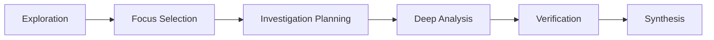

# Analyze

The analyze skill provides systematic codebase investigation with structured
phases and evidence requirements. Use it as the first step before planning any
non-trivial changes.



| Phase                  | Actions                                                                        |
| ---------------------- | ------------------------------------------------------------------------------ |
| Exploration            | Delegate to Explore agent; process structure, tech stack, patterns             |
| Focus Selection        | Classify areas (architecture, performance, security, quality); assign P1/P2/P3 |
| Investigation Planning | Commit to specific files and questions; create accountability contract         |
| Deep Analysis          | Progressive investigation; document with file:line + quoted code               |
| Verification           | Audit completeness; ensure all commitments addressed                           |
| Synthesis              | Consolidate by severity; provide prioritized recommendations                   |

## When to Use

- Unfamiliar codebase requiring systematic understanding
- Security review or vulnerability assessment
- Performance analysis before optimization
- Architecture evaluation before major refactoring
- Any situation requiring evidence-backed findings (not impressions)

## When to Skip

- You already understand the codebase well
- Simple bug fix with obvious scope
- User has provided comprehensive context

## Example Usage

```
Use your analyze skill to understand this codebase.
Focus on security and architecture before we plan the authentication refactor.
```

The skill outputs findings organized by severity (CRITICAL/HIGH/MEDIUM/LOW),
each with file:line references and quoted code. This feeds directly into
planning -- you have evidence-backed understanding before proposing changes.
