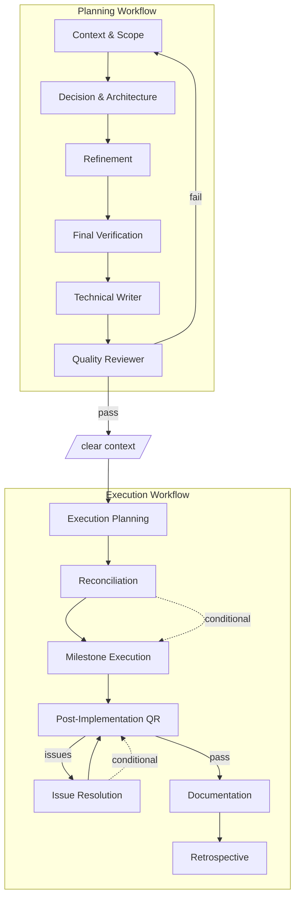

# Planner

The planner skill provides both planning and execution workflows:

## Planning Workflow

| Step                    | Actions                                                                      |
| ----------------------- | ---------------------------------------------------------------------------- |
| Context & Scope         | Confirm path, define scope, identify approaches, list constraints            |
| Decision & Architecture | Evaluate approaches, select with reasoning, diagram, break into milestones   |
| Refinement              | Document risks, add uncertainty flags, specify paths and criteria            |
| Final Verification      | Verify completeness, check specs, write to file                              |
| Technical Writer        | Scrub temporal comments, add WHY comments, enrich rationale                  |
| Quality Reviewer        | Check reliability, conformance; return PASS/PASS_WITH_CONCERNS/NEEDS_CHANGES |

The review feedback loop catches LLM mistakes before execution begins. Plans
frequently have gaps -- missing error handling, incomplete acceptance criteria,
ambiguous specifications. The workflow iterates until QR passes.

## Execution Workflow

After planning completes and the user clears context (`/clear`), execution
proceeds through seven steps:

| Step                   | Purpose                                                         |
| ---------------------- | --------------------------------------------------------------- |
| Execution Planning     | Analyze plan, detect reconciliation signals, output strategy    |
| Reconciliation         | (conditional) Validate existing code against plan               |
| Milestone Execution    | Delegate to agents, run tests; repeat until all complete        |
| Post-Implementation QR | Quality review of implemented code                              |
| Issue Resolution       | (conditional) Present issues, collect decisions, delegate fixes |
| Documentation          | Technical writer updates CLAUDE.md/README.md                    |
| Retrospective          | Present execution summary                                       |

The coordinator:

- Never writes code directly (delegates to developers)
- Parallelizes independent work across up to 4 developers per milestone
- Runs quality review after all milestones complete
- Loops through issue resolution until QR passes
- Invokes technical writer only after QR passes

**Reconciliation** handles resume scenarios. If the user's request contains
signals like "already implemented", "resume", or "partially complete", step 2
validates existing code against plan requirements before executing remaining
milestones.

**Issue Resolution** presents each QR finding individually with options (Fix /
Skip / Alternative). Fixes are delegated to developers or technical writers,
then QR runs again. This cycle repeats until QR passes.
